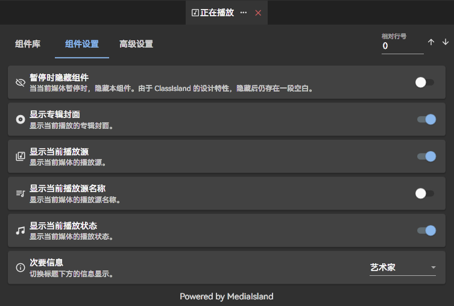

# MediaIsland

MediaIsland 是一款 [ClassIsland](https://classisland.tech) 插件，用于在 ClassIsland 主界面上显示 Windows [SMTC](https://learn.microsoft.com/en-us/uwp/api/windows.media.systemmediatransportcontrols) 媒体信息。

## 组件

**正在播放**

显示正在播放的媒体信息，可按需调整显示内容。

  
更多使用方式...

    搭配 <a href="https://github.com/LiPolymer">LiPolymer</a> 佬的 <a href="https://github.com/LiPolymer/ExtraIsland">ExtraIsland</a> 的【当前活动】组件，并启用「启用歌词」功能：
    
  

> [!IMPORTANT]
>
> 本插件的内存占用较大，低性能设备请谨慎使用。

> [!NOTE]
> 
> 在较新的 Windows 版本中，使用部分应用可能无法正常获取播放器信息。

## 要求

本插件需要 Windows 10 Build 17763 (1809) 或以上版本。

## 开发计划 & 已知问题

请移步 [Discussion](https://github.com/bywhite0/MediaIsland/discussions/10)

## 致谢

本项目使用了以下第三方库：

- [ClassIsland.PluginSdk](https://www.nuget.org/packages/ClassIsland.PluginSdk)
- [WindowsAPICodePackShell](https://www.nuget.org/packages/WindowsAPICodePackShell)
- [Dubya.WindowsMediaController](https://www.nuget.org/packages/Dubya.WindowsMediaController)

## 许可

本项目基于 GNU Affero General Public License v3.0 许可。

本项目部分使用了 [DubyaDude/WindowsMediaController](https://github.com/DubyaDude/WindowsMediaController) 的代码，其内容仍基于 MIT 许可。
